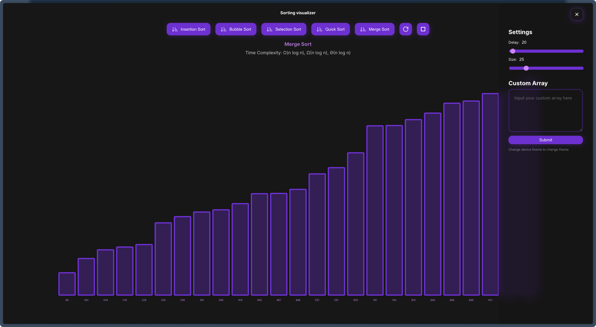

# Sorting Visualizer App

Welcome to the Sorting Visualizer App, a powerful tool that allows you to interactively explore and understand various sorting algorithms.

## Features

-   Visualize sorting algorithms: Insertion, Bubble, Selection, Quick, Merge.

-   Markdown preview of sorting algorithms.

-   Adjust delay and array length for control.

-   Custom array input for a personalized experience.

-   Device-based theme switching.

## Links

-   Explore the Sorting Visualizer App live at [Link](https://sorting-visualizer-rmk.netlify.app).

-   Check out our GitHub project board at [Link](https://github.com/users/raazi-muhammed/projects/) for more details.

## About

-   **Author:** Raazi Muhammed K
-   **GitHub:** [raazi-muhammed](https://github.com/raazi-muhammed)
-   **Linkedin:** [raazimuhammed](https://www.linkedin.com/in/raazimuhammed/)

## Getting Started

To run the Sorting Visualizer App locally, follow these steps:

1. Clone the repository.
2. Navigate to the `sorting-visualizer` directory using `cd sorting-visualizer`.
3. Install dependencies using `npm install`.
4. Start the app with `npm run dev`.
5. Open your browser and go to `http://localhost:5173`.
